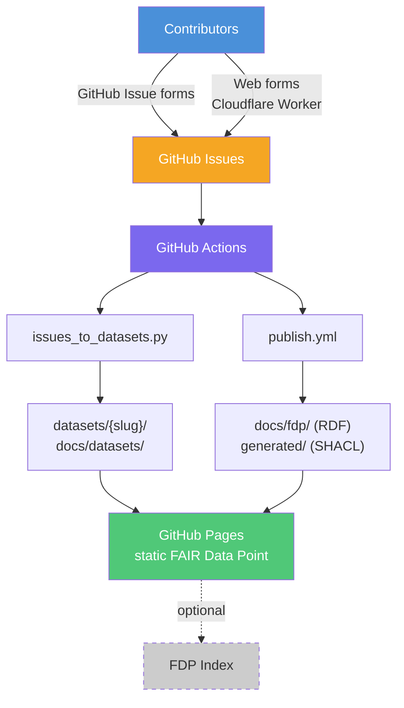

# Deploying a Static FAIR Data Point + Dataset Index

This guide explains how to set up a **Static FAIR Data Point (FDP)** with an
auto-generated dataset index using GitHub infrastructure. The framework collects
structured contributions via GitHub Issues, converts them to DCAT-compliant RDF,
and publishes them as a FAIR Data Point on GitHub Pages — no server required.

## Architecture overview



## Prerequisites

### GitHub (required)

You need a **GitHub account** with a repository to host the FDP. A **public**
repository is recommended because GitHub Pages is free for public repos (paid
plans required for private repo Pages).

What GitHub provides in this setup:

| Component | What it does |
|---|---|
| **GitHub Issues** | Structured submission forms — contributors fill in fields, each issue becomes a dataset |
| **GitHub Actions** | CI/CD pipelines that validate RDF, convert issues to datasets, and publish the FDP — runs automatically on push/issue events, free for public repos (2,000 min/month for private) |
| **GitHub Pages** | Static hosting for the FDP — serves your RDF (Turtle, JSON-LD), HTML index, and landing page at a public URL |

**GitHub tokens needed:**

- `GITHUB_TOKEN` — automatically provided by Actions, no setup required.
- A **fine-grained Personal Access Token** (PAT) is needed only if you use the
  optional Cloudflare Worker (scope: `Issues: Read & Write` on your repo only)
  or want to ping the FDP index (scope: `Contents: Write` on `StaticFDP/fdp-index`).

### Python 3.12+ (required)

Used by the `issues_to_datasets.py` script that converts GitHub Issues into
DCAT-compliant RDF datasets. Runs inside GitHub Actions (no local install
needed for production), but useful locally for testing. The script uses only
the standard library plus `rdflib` (installed in the workflow).

### Node.js 20+ (required)

Used for **ShEx validation** via `@shexjs/cli`. ShEx (Shape Expressions) is the
primary schema language that validates your FDP metadata and dataset descriptions
against the FDP specification. Like Python, this runs inside GitHub Actions but
is useful locally when authoring or debugging RDF.

### Custom domain (optional)

By default, GitHub Pages publishes at `https://<org>.github.io/<repo>/`. For a
custom domain (e.g. `fdp.example.org`):

1. Configure a `CNAME` DNS record pointing to `<org>.github.io`
2. The `setup.sh` script creates a `docs/CNAME` file automatically
3. Enable the custom domain in **Settings > Pages**

### Cloudflare (optional)

Only needed if you want to accept contributions from users **without a GitHub
account** via web forms. The Cloudflare Worker acts as a lightweight form
receiver that creates GitHub Issues on behalf of anonymous users.

What you need from Cloudflare:

| Item | Where to get it | Used for |
|---|---|---|
| **Cloudflare account** | [dash.cloudflare.com](https://dash.cloudflare.com/) | Hosting the Worker |
| **API token** | Account > API Tokens > Create Token | Deploying the Worker and invalidating cache |
| **Account ID** | Account > Overview sidebar | API calls |
| **KV namespace** (optional) | Workers & Pages > KV | Cache invalidation after publish |
| **Wrangler CLI** | `npm install -g wrangler` | Deploying and managing the Worker |

The Worker runs on Cloudflare's free tier (100,000 requests/day).

If you don't need anonymous submissions, skip everything Cloudflare-related —
the rest of the framework works entirely on GitHub.

### ORCID (optional)

If you use the Cloudflare Worker web forms, contributors authenticate via
[ORCID](https://orcid.org/) to attach a verified name and persistent identifier
to their submission. This avoids anonymous contributions while not requiring a
GitHub account.

What you need:

1. Register an **ORCID API client** at
   [orcid.org/developer-tools](https://orcid.org/developer-tools) (free, public API)
2. Note the **Client ID** and **Client Secret**
3. Store them as Cloudflare Worker secrets:
   ```bash
   wrangler secret put ORCID_CLIENT_ID
   wrangler secret put ORCID_CLIENT_SECRET
   ```

The Worker uses the ORCID OAuth flow to read the contributor's name and ORCID iD,
which are then included in the GitHub Issue it creates. Contributors only need a
free ORCID account — no institutional affiliation required.

If you don't use the web forms (GitHub-only workflow), ORCID is not needed;
contributor names come from the GitHub profile instead.

### StaticFDP Index (optional)

To make your FDP discoverable in the [StaticFDP index](https://staticfdp.github.io/fdp-index/),
the `publish.yml` workflow can ping the index after each publish via GitHub
Repository Dispatch. This requires a fine-grained PAT with `Contents: Write`
on the `StaticFDP/fdp-index` repository, stored as the `FDPINDEX_DISPATCH_TOKEN`
secret.

## Step-by-step setup

### 1. Create the repository structure

Use the provided `setup.sh` script to bootstrap a new repository:

```bash
chmod +x setup.sh
./setup.sh \
  --name "my-project" \
  --title "My Project — FAIR Data Point" \
  --org "MyOrg" \
  --publisher "My Working Group" \
  --publisher-url "https://example.org/" \
  --domain "fdp.example.org" \
  --license "https://creativecommons.org/licenses/by/4.0/" \
  --label "submission" \
  --output ./my-new-fdp
```

This generates a complete repository skeleton with all necessary files.

### 2. Copy ShEx validation profiles

The ShEx profiles are generic. Copy the `profiles/` directory as-is:

```bash
cp -r profiles/ my-new-fdp/profiles/
```

These schemas validate your FDP root, catalogs, and datasets against the
FDP specification. No changes needed unless you add custom metadata fields.

### 3. Configure the catalog metadata

Edit `my-new-fdp/metadata/fdp/catalog.ttl` (generated by `setup.sh`).
Replace the placeholder values:

- **Title and description** — describe your project
- **Publisher** — your organization
- **Theme taxonomy** — the ontologies or vocabularies relevant to your domain
- **Datasets** — add entries for each curated dataset you plan to include

See `templates/catalog.ttl` for the annotated template.

### 4. Set up GitHub Issue templates

The `templates/` directory contains parameterized issue form templates.
Customize:

- **`01-contribution.yml`** — the main submission form
  - Field labels, placeholders, dropdown options
  - Identifier vocabulary table (replace with vocabularies relevant to your domain)
  - Issue labels (used by workflows to trigger processing)

- **`config.yml`** — external links shown on the issue creation page

### 5. Configure GitHub Actions workflows

Copy the four workflow files from `templates/workflows/` into
`.github/workflows/`. Each workflow has `# CUSTOMIZE` comments marking
lines you need to update:

| Workflow | Purpose | Key customizations |
|---|---|---|
| `validate.yml` | ShEx validation on PRs | None (generic) |
| `publish.yml` | Build + deploy FDP to GitHub Pages | FDP base URL, Cloudflare secrets |
| `convert-issues.yml` | Issues to FAIR datasets + index | Label names, FDP base URL |
| `deploy-worker.yml` | Deploy Cloudflare Worker (optional) | Repo name, secrets |

### 6. Set repository secrets

In **Settings > Secrets and variables > Actions**, add:

| Secret | Required | Purpose |
|---|---|---|
| `GITHUB_TOKEN` | Auto-provided | Issue reading + committing generated files |
| `CF_API_TOKEN` | Optional | Cloudflare API token (for Worker + cache invalidation) |
| `CF_ACCOUNT_ID` | Optional | Cloudflare account ID |
| `CF_KV_NS_ID` | Optional | Cloudflare KV namespace (cache invalidation) |
| `FDPINDEX_DISPATCH_TOKEN` | Optional | PAT to ping StaticFDP/fdp-index after publish |
| `ISSUES_TOKEN` | Optional | Fine-grained PAT for the Cloudflare Worker |

### 7. Enable GitHub Pages

Go to **Settings > Pages** and set:
- Source: **Deploy from a branch**
- Branch: `main`, folder: `/docs`

Or let the `publish.yml` workflow enable it automatically on first run.

### 8. (Optional) Deploy the web form receiver

If you want contributions from users without GitHub accounts:

```bash
cd my-new-fdp/worker
cp ../../templates/wrangler.toml .
# Edit GITHUB_REPO and LANDING_PAGE in wrangler.toml
npm install -g wrangler
wrangler login
wrangler secret put GITHUB_TOKEN   # paste your fine-grained PAT
wrangler deploy
```

### 9. (Optional) Register with the FDP Index

To make your FDP discoverable by the [StaticFDP index](https://staticfdp.github.io/fdp-index/):

1. Create a fine-grained PAT with `contents:write` on `StaticFDP/fdp-index`
2. Add it as `FDPINDEX_DISPATCH_TOKEN` in your repo secrets
3. The `publish.yml` workflow will automatically ping the index on each publish

## Adapting the `issues_to_datasets.py` script

The conversion script (`scripts/issues_to_datasets.py`) turns GitHub Issues into
per-topic FAIR datasets. When adapting it for your domain, you will need to update:

1. **`ONTOLOGY_IRI`** — the mapping from identifier prefixes (e.g. `EX:12345`)
   to full IRIs. Each entry defines a prefix, an IRI template, and a sort priority.
2. **`FDP_BASE_URL`** — the base URL where your FDP will be published.
3. **Label parsing** — the `if:` conditions that match issue labels to dataset types.
4. **Form field extraction** — the logic that reads structured fields from issue bodies
   (follows GitHub Issue form YAML field IDs).
5. **HTML index template** — the landing page generated at `docs/datasets/index.html`.

The rest of the script (GitHub API pagination, Turtle serialization, DCAT metadata
generation, JSON-LD output) is generic and works for any domain.

## Customizing labels

The workflows trigger on specific GitHub Issue labels. The defaults are:

- `submission` — main submissions
- `vocab-gap` — vocabulary/ontology gap reports
- `data-gap` — data model gap reports

To change these, update:
1. Issue template `labels:` fields
2. Workflow `if:` conditions in `convert-issues.yml`
3. Label matching in `scripts/issues_to_datasets.py`

## Adding new submission types

To add a new type of contribution:

1. Create a new issue template in `.github/ISSUE_TEMPLATE/`
2. Add a corresponding label
3. Extend `scripts/issues_to_datasets.py` to parse the new form fields
4. Add the workflow trigger condition for the new label

## File reference

```
static-fdp/
  DEPLOY.md                              # This file
  setup.sh                               # Bootstrap script for new instances
  profiles/                              # ShEx validation schemas
    FairDataPoint.shex
    Catalog.shex
    Dataset.shex
  templates/
    catalog.ttl                          # Annotated FDP catalog template
    wrangler.toml                        # Cloudflare Worker config template
    issue-templates/
      01-contribution.yml                # Issue form template
      config.yml                         # Issue template config
    workflows/
      validate.yml                       # ShEx/SHACL validation
      publish.yml                        # Build + publish FDP
      convert-issues.yml                 # Issues -> FAIR datasets
      deploy-worker.yml                  # Deploy Cloudflare Worker
  fdp-index/
    README.md                            # FDP Index deployment guide
  examples/
    leiden-longevity-study/              # Worked example (catalog + datasets)
```
