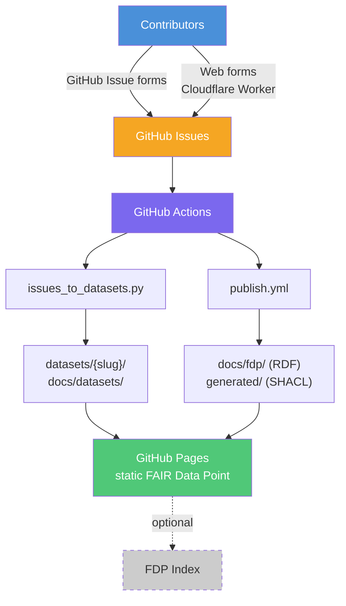
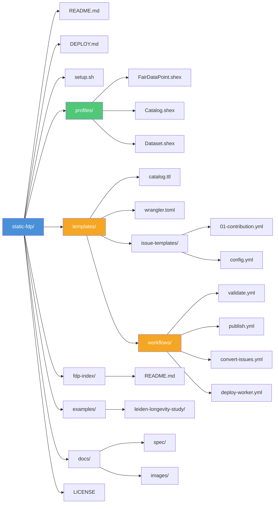

# Static FAIR Data Point

A framework for publishing a [FAIR Data Point (FDP)](https://specs.fairdatapoint.org/)
backed entirely by static files on GitHub — no running server required.

Metadata is maintained as RDF Turtle in a Git repository, validated with
[ShEx](https://shex.io/), and published to GitHub Pages. Community contributions
arrive via GitHub Issue forms (or optional web forms) and are automatically
converted into DCAT-compliant datasets by GitHub Actions.

## How it works



1. **Contribute** — submit structured data via a GitHub Issue form or web form
2. **Validate** — ShEx schemas check every RDF resource on every PR
3. **Convert** — GitHub Actions transform issues into per-topic FAIR datasets
4. **Publish** — Turtle, JSON-LD, and HTML are served from GitHub Pages
5. **Index** — an optional FDP index crawls and aggregates published FDPs

## Quick start

```bash
git clone https://github.com/StaticFDP/static-fdp.git
cd static-fdp
chmod +x setup.sh

./setup.sh \
  --name "my-project" \
  --title "My FAIR Data Point" \
  --org "MyOrg" \
  --publisher "My Working Group" \
  --publisher-url "https://example.org/" \
  --domain "fdp.example.org" \
  --output ./my-new-fdp
```

This generates a ready-to-push repository with ShEx profiles, GitHub Actions
workflows, issue templates, and a DCAT catalog — all parameterized for your
project.

See **[DEPLOY.md](DEPLOY.md)** for the full deployment guide, including
prerequisites and optional components (Cloudflare Worker, ORCID, FDP Index).

## Repository layout



## Validation

ShEx is the **primary** validation gate — PRs cannot merge if ShEx validation
fails. SHACL schemas are generated automatically from ShEx for ecosystem
compatibility but are not blocking.

| Schema | Validates |
|---|---|
| `profiles/FairDataPoint.shex` | FDP root resource |
| `profiles/Catalog.shex` | `dcat:Catalog` entries |
| `profiles/Dataset.shex` | `dcat:Dataset` entries |

## FDP Index

The companion [fdp-index](https://github.com/StaticFDP/fdp-index) repository
provides a serverless FDP index that crawls registered FDPs daily and publishes
a searchable catalog at [staticfdp.github.io/fdp-index](https://staticfdp.github.io/fdp-index/).

See **[fdp-index/README.md](fdp-index/README.md)** for how to register your
FDP or deploy your own index.

## Live deployments

| FDP | Repository |
|---|---|
| [GA4GH Rare Disease Trajectories](https://fdp.semscape.org/ga4gh-rare-disease-trajectories/) | [StaticFDP/ga4gh-rare-disease-trajectories](https://github.com/StaticFDP/ga4gh-rare-disease-trajectories) |

## Specification

The [FDP Layout specification](docs/spec/respec.html) describes the RDF graph
structures required to construct a conformant FAIR Data Point, based on DCAT2.

## Authors

| Name | ORCID |
|---|---|
| Rajaram Kaliyaperumal | [0000-0002-1215-167X](https://orcid.org/0000-0002-1215-167X) |
| Eric G. Prud'hommeaux | [0000-0003-1775-9921](https://orcid.org/0000-0003-1775-9921) |
| Egon Willighagen | [0000-0001-7542-0286](https://orcid.org/0000-0001-7542-0286) |
| Andra Waagmeester | [0000-0001-9773-4008](https://orcid.org/0000-0001-9773-4008) |

## Previous version

The original EJP-RD-specific implementation is preserved on the
[`archive/v0-ejprd`](https://github.com/StaticFDP/static-fdp/tree/archive/v0-ejprd)
branch.

## License

[MIT](LICENSE)
