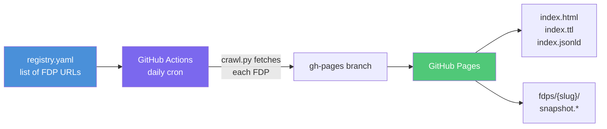

# FDP Index

The [FDP Index](https://github.com/StaticFDP/fdp-index) is a serverless
registry that crawls registered FAIR Data Points daily and publishes a
searchable catalog — backed entirely by GitHub Actions and GitHub Pages.

Live index: **[staticfdp.github.io/fdp-index](https://staticfdp.github.io/fdp-index/)**

## How it works



1. **Registry** — `registry.yaml` in the fdp-index repo lists every FDP root URL to crawl
2. **Crawl** — a GitHub Actions workflow runs daily at 03:00 UTC, fetches metadata from each FDP, and commits results to the `gh-pages` branch
3. **Publish** — the index is served as static files from GitHub Pages
4. **Ping** — FDP repos can trigger an immediate re-crawl via GitHub Repository Dispatch (no waiting for the daily run)

## Registering your FDP

### Option A — Pull request (recommended)

Add your FDP to `registry.yaml` in the
[fdp-index repo](https://github.com/StaticFDP/fdp-index) and open a PR:

```yaml
fdps:
  - url:     https://fdp.example.org/my-project/fdp/
    label:   "My FAIR Data Point"
    added:   "2026-01-15"
    contact: "you@example.org"
```

Once merged, your FDP will be crawled in the next daily run.

### Option B — Automated ping from your FDP repo

Add this step to your `publish.yml` workflow so the index is updated every time
you publish:

```yaml
- name: Ping FDP index
  env:
    FDPINDEX_TOKEN: ${{ secrets.FDPINDEX_DISPATCH_TOKEN }}
  run: |
    if [ -z "$FDPINDEX_TOKEN" ]; then
      echo "No FDPINDEX_DISPATCH_TOKEN — skipping"
      exit 0
    fi
    curl -sf -X POST \
      -H "Authorization: Bearer ${FDPINDEX_TOKEN}" \
      -H "Accept: application/vnd.github.v3+json" \
      -H "Content-Type: application/json" \
      -d '{"event_type":"fdp-ping","client_payload":{"url":"${{ vars.FDP_ROOT_URL }}"}}' \
      https://api.github.com/repos/StaticFDP/fdp-index/dispatches
```

`FDPINDEX_DISPATCH_TOKEN` must be a **fine-grained PAT** with `Contents: Write`
on `StaticFDP/fdp-index`. On first ping, the FDP is added to `registry.yaml`
automatically.

This step is already included in the `publish.yml` template provided by this
repository (see `templates/workflows/publish.yml`).

## Index outputs

The crawl produces these files on the `gh-pages` branch, served via GitHub Pages:

| File | Format | Description |
|---|---|---|
| `index.html` | HTML | Human-browsable index of all FDPs |
| `index.jsonld` | JSON-LD | Full index — all FDP metadata |
| `index.ttl` | Turtle | Same, as RDF Turtle |
| `fdps/{slug}/snapshot.jsonld` | JSON-LD | Per-FDP metadata snapshot |
| `fdps/{slug}/snapshot.ttl` | Turtle | Per-FDP metadata snapshot |
| `crawl-report.json` | JSON | Last crawl statistics and errors |

## Deploying your own index

If you want to run a private or domain-specific FDP index (rather than
registering with the shared StaticFDP index), you can fork the
[fdp-index repo](https://github.com/StaticFDP/fdp-index):

### Prerequisites

- A GitHub repository (public for free Pages hosting)
- Python 3.12+ (runs in GitHub Actions)
- `rdflib` and `requests` (installed by the workflow)

### Steps

1. **Fork** `StaticFDP/fdp-index` (or create a new repo and copy the files)

2. **Edit `registry.yaml`** — replace the entries with FDP URLs you want to crawl

3. **Enable GitHub Pages** — go to Settings > Pages, set source to `gh-pages` branch

4. **Configure the crawl schedule** — edit `.github/workflows/crawl.yml` to change
   the cron expression (default: daily at 03:00 UTC)

5. **Push to main** — the workflow runs automatically and creates the `gh-pages`
   branch on first run

6. **(Optional) Set up a custom domain** — add a `CNAME` file to the `gh-pages`
   branch and configure DNS

### Accepting pings from FDP repos

For FDP repos to trigger re-crawls of your private index:

1. Create a fine-grained PAT with `Contents: Write` on your index repo
2. Share it with FDP repo owners to set as `FDPINDEX_DISPATCH_TOKEN`
3. Have them update the dispatch URL in their `publish.yml` to point to your
   index repo instead of `StaticFDP/fdp-index`

## Triggering a manual crawl

From the GitHub Actions tab of the fdp-index repo, click **Run workflow** on
the "Crawl FDPs" workflow. You can optionally specify a single URL to crawl
instead of the full registry.

From the command line:

```bash
gh workflow run crawl.yml --repo StaticFDP/fdp-index
```

Or to crawl a single FDP:

```bash
gh workflow run crawl.yml --repo StaticFDP/fdp-index \
  -f single_url="https://fdp.example.org/my-fdp/"
```
